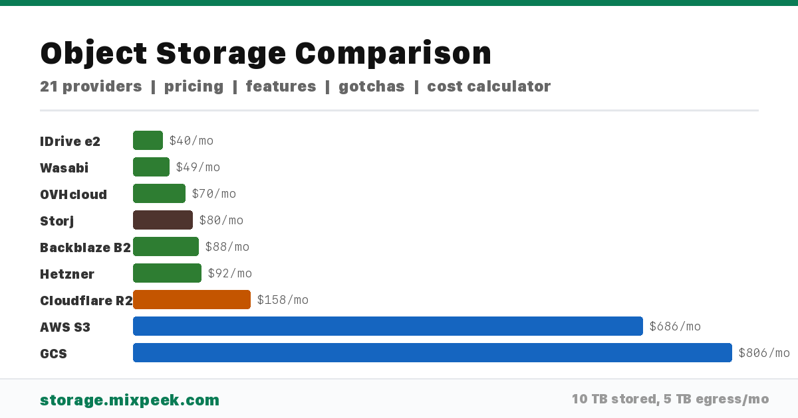

# Awesome Object Storage 

  

> A curated, opinionated guide to S3-compatible object storage — pricing, features, gotchas, and tools.

Choosing object storage looks simple until you're comparing 7 pricing dimensions, hidden retention policies, and "S3-compatible" claims that break on multipart uploads. We built this because we got tired of finding out about Wasabi's 90-day minimum retention policy AFTER migrating 50 TB.

This list covers **21 providers** across hyperscalers, alternatives, edge/CDN-native, self-hosted, and decentralized options. Every claim is sourced. Every gotcha is real. PRs welcome.

## Contents

- [Quick Comparison](#quick-comparison)
- [Provider Profiles](#provider-profiles)
- [The Gotchas Nobody Tells You](#the-gotchas-nobody-tells-you)
- [Cost Cheat Sheet](#cost-cheat-sheet)
- [Decision Framework](#decision-framework)
- [Architecture Patterns](#architecture-patterns)
- [What Happens When You Outgrow Your Provider](#what-happens-when-you-outgrow-your-provider)
- [Tools & Libraries](#tools--libraries)
- [Benchmarks & Research](#benchmarks--research)
- [Real-World References](#real-world-references)
- [Changelog](#changelog)
- [Frequently Asked Questions](#frequently-asked-questions)

---

## Quick Comparison

All prices are list prices in USD as of Q1 2026. Storage is per GB/month (standard/hot tier). Egress is per GB after free allowance. "S3 Compat" means the provider supports the S3 API — see [the compatibility spectrum](#s3-compatible-is-a-spectrum) for what that actually means.

| Provider                                                                            | Storage $/GB/mo | Egress $/GB | Free Egress     | Tiers | Max Object | S3 Compat                                                                                            | Object Lock | Versioning | Gotcha                                                      |
| ----------------------------------------------------------------------------------- | --------------- | ----------- | --------------- | ----- | ---------- | ---------------------------------------------------------------------------------------------------- | ----------- | ---------- | ----------------------------------------------------------- |
| [AWS S3](https://aws.amazon.com/s3/pricing/)                                        | $0.023          | $0.09       | 100 GB/mo       | 6     | 5 TB       | Native                                                                                               | Yes         | Yes        | Egress adds up fast                                         |
| [Google Cloud Storage](https://cloud.google.com/storage/pricing)                    | $0.020          | $0.12       | 100 GB/mo       | 4     | 5 TB       | [Interop](https://cloud.google.com/storage/docs/interoperability)                                    | Yes         | Yes        | Highest egress of the big 3                                 |
| [Azure Blob](https://azure.microsoft.com/en-us/pricing/details/storage/blobs/)      | $0.018          | $0.087      | 100 GB/mo       | 4     | 4.77 TB    | [Preview](https://learn.microsoft.com/en-us/azure/storage/blobs/s3-compatible-api)                   | Yes         | Yes        | Native API is not S3 — interop layer is preview             |
| [Cloudflare R2](https://developers.cloudflare.com/r2/pricing/)                      | $0.015          | $0          | Unlimited       | 2     | 5 TB       | [Full](https://developers.cloudflare.com/r2/api/s3/)                                                 | No          | No         | No versioning, no object lock                               |
| [Tigris](https://www.tigrisdata.com/docs/pricing/)                                  | $0.020          | $0          | Unlimited       | 4     | 5 TB       | [Full](https://www.tigrisdata.com/docs/api/)                                                         | Yes         | Yes        | Newer service, some limits TBD                              |
| [Backblaze B2](https://www.backblaze.com/cloud-storage/pricing)                     | $0.006          | $0.01       | 3x storage      | 1     | 10 TB      | [Full](https://www.backblaze.com/docs/cloud-storage-s3-compatible-api)                               | Yes         | Yes        | Only 3 regions (US-West, US-East, EU-Central)               |
| [Wasabi](https://wasabi.com/pricing)                                                | $0.0049         | $0*         | Reasonable use  | 1     | 5 TB       | [Full](https://docs.wasabi.com/docs/what-are-the-service-urls-for-wasabis-different-storage-regions) | Yes         | Yes        | 90-day minimum retention — you pay even if you delete early |
| [DigitalOcean Spaces](https://www.digitalocean.com/pricing/spaces)                  | $0.020          | $0.01       | 1 TB/mo         | 1     | 5 GB       | [Full](https://docs.digitalocean.com/products/spaces/)                                               | No          | Yes        | Max object size is 5 GB, not 5 TB                           |
| [MinIO](https://min.io/)                                                            | Self-host       | Self-host   | N/A             | ILM   | 5 TB       | [Full](https://min.io/product/s3-compatibility)                                                      | Yes         | Yes        | AGPL-3.0 — you run and maintain everything                  |
| [Storj](https://www.storj.io/pricing)                                               | $0.004          | $0.007      | None            | 1     | Unlimited  | [Full](https://docs.storj.io/dcs/api-reference/s3-compatible-gateway)                                | Yes         | Yes        | Per-segment fees on small files; claims 11 nines durability |
| [Hetzner Object Storage](https://www.hetzner.com/storage/object-storage/)           | $0.0052         | $0.01       | 1 TB internal   | 1     | 5 TB       | [Full](https://docs.hetzner.com/storage/object-storage/overview/)                                    | Yes         | Yes        | EU-only regions                                             |
| [Oracle Cloud Object Storage](https://www.oracle.com/cloud/storage/pricing/)        | $0.0255         | $0.0085     | 10 TB/mo        | 3     | 10 TB      | [Full](https://docs.oracle.com/en-us/iaas/Content/Object/Tasks/s3compatibleapi.htm)                  | Yes         | Yes        | 10 TB free egress is generous; UI is less polished          |
| [Scaleway Object Storage](https://www.scaleway.com/en/pricing/?tags=storage)        | $0.012          | $0.01       | 75 GB/mo        | 3     | 5 TB       | [Full](https://www.scaleway.com/en/docs/storage/object/)                                             | Yes         | Yes        | EU-only; unusual per-GET pricing tiers                      |
| [Vultr Object Storage](https://www.vultr.com/pricing/#object-storage)               | $0.006          | $0.01       | 1 TB/mo         | 1     | 5 GB       | [Full](https://www.vultr.com/docs/vultr-object-storage/)                                             | No          | Yes        | No SSE, durability not published, 5 GB max object           |
| [Akamai/Linode Object Storage](https://www.linode.com/pricing/#object-storage)      | $0.020          | $0.005      | Transfer pool   | 1     | 5 GB       | [Full](https://techdocs.akamai.com/cloud-computing/docs/object-storage)                              | No          | Yes        | Max object 5 GB — no multipart above that                   |
| [IDrive e2](https://www.idrive.com/e2/pricing)                                      | $0.004          | $0*         | Reasonable use  | 1     | 5 TB       | [Full](https://www.idrive.com/e2/s3-compatible-api)                                                  | Yes         | Yes        | Unique per-region access keys (no global key)               |
| [OVHcloud Object Storage](https://www.ovhcloud.com/en/public-cloud/object-storage/) | $0.007          | $0          | Free (Jan 2026) | 4     | 5 TB       | [Full](https://docs.ovh.com/gb/en/storage/object-storage/s3/)                                        | Yes         | Yes        | 30-day minimum retention on all tiers                       |
| [IBM Cloud Object Storage](https://www.ibm.com/cloud/object-storage/pricing)        | $0.022          | $0.09       | One-Rate plan   | 5     | 10 TB      | [Full](https://cloud.ibm.com/docs/cloud-object-storage?topic=cloud-object-storage-compatibility-api) | Yes         | Yes        | Complex pricing with Smart Tier, One-Rate, and Standard     |
| [Nebius Object Storage](https://nebius.com/services/storage)                        | $0.0164         | $0.01       | Free internal   | 4     | 5 TB       | [Full](https://docs.nebius.com/storage/s3/)                                                          | Yes         | Yes        | EU-only; newer brand (Yandex Cloud spinoff)                 |
| [Impossible Cloud](https://impossiblecloud.com/pricing)                             | $0.006          | $0          | Free            | 1     | 5 TB       | [Full](https://docs.impossiblecloud.com/)                                                            | Yes         | Yes        | Newer, EU-focused, limited track record                     |
| [Fastly Object Storage](https://www.fastly.com/products/storage)                    | $0.012          | $0          | Included w/ CDN | 1     | 5 TB       | [Full](https://docs.fastly.com/en/storage/)                                                          | No          | No         | Newer product, fewer features than mature providers         |

`$0*` = Free egress with "reasonable use" policy — typically means egress cannot exceed storage volume. Check the provider's terms.

---

## Provider Profiles

Detailed profiles with full feature matrices, pricing breakdowns, and source links for each provider are in the [`data/providers/`](data/providers/) directory.

---

## The Gotchas Nobody Tells You

### Egress "Free" Doesn't Always Mean Free

Cloudflare R2 and Tigris genuinely offer unlimited free egress — there's no asterisk. But several providers advertise "free egress" with strings attached:

- Wasabi: Egress is free only if your monthly egress doesn't exceed your stored volume. Transfer 2x what you store and you'll get a call from their sales team, or see your account flagged. Their pricing FAQ calls this "reasonable use."
- IDrive e2: Same model as Wasabi — egress is free under a "reasonable use" policy. The threshold isn't publicly defined with precision.
- OVHcloud: Made egress free in January 2026, but the 30-day minimum retention still applies to all tiers — delete early, pay anyway.
- Backblaze B2: 3x your stored volume is free. Beyond that, $0.01/GB. Generous for most workloads, but media streaming will blow through it.

**Bottom line**: If your workload is egress-heavy (CDN origin, ML training data distribution, media streaming), only R2, Tigris, Fastly, and Impossible Cloud offer truly unlimited free egress without caveats.

### Minimum Retention Will Burn You

This is the gotcha that costs real money and nobody reads the fine print:

- Wasabi: 90-day minimum retention. Delete an object after 30 days? You still pay for 90. This is per-object, not per-account. On a 50 TB dataset with churn, this can double your effective cost.
- OVHcloud: 30-day minimum on **all** storage tiers, including Standard. Not just archive.
- AWS S3 Glacier Instant Retrieval: 90-day minimum. Glacier Deep Archive: 180-day minimum. S3 Standard has no minimum.
- GCS Nearline: 30-day minimum. Coldline: 90 days. Archive: 365 days.

**Rule of thumb**: If you're storing data with high churn (temp files, build artifacts, ephemeral ML checkpoints), avoid any provider with minimum retention. Use R2, B2, Hetzner, or standard-tier hyperscaler storage.

### "S3 Compatible" Is a Spectrum

Every provider on this list claims S3 compatibility. In practice, compatibility ranges from "passes the full AWS S3 test suite" to "supports GET and PUT on a good day." Here's what actually varies:

- Multipart uploads: Most support it. DigitalOcean Spaces, Vultr, and Linode cap objects at 5 GB, which means multipart is capped too.
- Object Lock / WORM: R2, Fastly, Vultr, DigitalOcean Spaces, and Linode do not support it. If you need immutable backups for compliance, check before migrating.
- Versioning: R2 and Fastly don't support it. If your application depends on versioned objects, these are not drop-in replacements.
- Server-Side Encryption (SSE): Vultr doesn't support SSE. Others vary between SSE-S3, SSE-KMS, and SSE-C.
- Presigned URLs: Generally work everywhere, but edge cases around expiration and regional endpoints can bite you on smaller providers.
- Bucket notifications / Event Grid: Only AWS, GCS (via Pub/Sub), and MinIO support S3-style event notifications. Most alternatives don't.
- Select / Query: S3 Select and similar in-place query features are largely AWS-only. Storj, MinIO have partial support.

**Test before migrating**. Run your actual application against the target provider's S3 endpoint. Don't trust the compatibility page — trust your integration tests.

### Durability Is Not Identical

AWS S3 quotes 99.999999999% (11 nines) durability. Most providers quote similar numbers. But the engineering behind those numbers varies enormously:

- Hyperscalers (AWS, GCS, Azure): Data is replicated across multiple availability zones within a region, with independent power and networking. This is battle-tested at exabyte scale.
- Storj: Uses erasure coding across a global network of independent storage nodes. Claims 11 nines. The architecture is genuinely different — your data is sharded across thousands of nodes, so no single datacenter failure loses data.
- Backblaze B2: Replicates within a single datacenter with Reed-Solomon erasure coding. Published [durability data](https://www.backblaze.com/blog/cloud-storage-durability/) openly.
- Vultr, DigitalOcean Spaces, Linode: Durability numbers are either not published or vaguely stated. This doesn't mean the data is unsafe, but you're trusting without verification.
- Hetzner, Scaleway, OVHcloud: European providers with solid infrastructure, but fewer regions means fewer geographic redundancy options.

**If durability is critical** (healthcare, legal, financial records), stick with providers that publish verifiable durability data and offer cross-region replication. Or replicate across providers yourself using rclone.

---

## Cost Cheat Sheet

Real-world monthly cost for a common workload: **10 TB stored, 5 TB egress/month, 10M GET requests, 1M PUT requests**.

| Provider      | Storage | Egress | GETs  | PUTs  | **Total/mo** |
| ------------- | ------- | ------ | ----- | ----- | ------------ |
| IDrive e2     | $40     | $0*    | $1    | $5    | **~$46**     |
| Storj         | $40     | $35    | $1    | $5    | **~$81**     |
| Wasabi        | $49     | $0*    | $0    | $0    | **~$49**     |
| Backblaze B2  | $60     | $20    | $4    | $5    | **~$89**     |
| Cloudflare R2 | $150    | $0     | $3.60 | $4.50 | **~$158**    |
| OVHcloud      | $70     | $0     | $1    | $5    | **~$76**     |
| Hetzner       | $52     | $40    | $1    | $5    | **~$98**     |
| AWS S3        | $230    | $450   | $4    | $5    | **~$689**    |
| GCS           | $200    | $600   | $4    | $5    | **~$809**    |

`$0*` means subject to reasonable-use egress policy. If your egress exceeds storage volume, costs may apply. Wasabi includes requests in storage pricing — no per-request fees. AWS and GCS prices are dramatically higher because of egress — if you're serving data to the internet, this is the line item that matters. R2 is expensive on storage but free on egress — the crossover point vs. B2 depends on your egress ratio.

**Your workload is different.** Use the [interactive cost calculator](https://storage.mixpeek.com) with your actual storage, egress, and operations numbers.

### Real-World Cost Migration Stories

- 50 TB from S3 to B2: A SaaS company running a media pipeline cut their monthly storage bill from ~$1,150 to ~$300 by moving to B2, plus reduced egress from $4,500/mo to ~$200/mo via the Cloudflare Bandwidth Alliance.
- 200 TB data lake on R2: A startup serving ML training datasets moved from S3 to R2. Storage cost went up slightly ($3,000 → $3,000) but egress dropped from $18,000/mo to $0. Net savings: ~$15,000/mo. The zero-egress model changes the economics completely for read-heavy workloads.
- Backup tier with Wasabi: An MSP managing 500+ client backups moved from S3 Standard to Wasabi. Storage dropped from $0.023 to $0.0049/GB — a 79% reduction. But they learned about the 90-day minimum the hard way when a client churned data early. [r/MSP discussion](https://www.reddit.com/r/msp/comments/13knm4h/).
- Oracle's 10 TB free egress: A data analytics firm using Oracle Cloud for their data lake found that the 10 TB/mo free egress covered 95% of their transfer needs, effectively making egress a non-issue. Total cost on Oracle was higher per-GB than B2, but lower total cost because they avoided egress charges entirely.

---

## Decision Framework

Opinionated recommendations. Your mileage may vary, but these are defensible starting points:

**I need the cheapest storage with minimal egress** -- Use Storj ($0.004/GB) or IDrive e2 ($0.004/GB). Both are S3-compatible with reasonable feature sets. Storj's per-segment fee penalizes lots of tiny files.

**I need zero egress fees, period** -- Use Cloudflare R2. No egress fees, no asterisks, no "reasonable use" policy. Trade-off: no versioning, no object lock.

**I need zero egress AND versioning/object lock** -- Use Tigris or Impossible Cloud. Both offer free egress with more features than R2, though they're newer services.

**I need a CDN origin** -- Use Cloudflare R2 (native Cloudflare CDN integration) or Fastly Object Storage (native Fastly CDN). Eliminates the origin-to-CDN egress that kills your bill with AWS.

**I need compliance / immutable backups** -- Use AWS S3 Object Lock (WORM compliance, SEC 17a-4 verified) or Wasabi (also supports Object Lock, much cheaper). B2 Object Lock is solid too.

**I need to keep it in the EU** -- Use Hetzner (cheapest), Scaleway (more features), or OVHcloud (free egress). All are EU-headquartered with EU-only datacenters.

**I need self-hosted / air-gapped** -- Use MinIO. It's the only serious self-hosted S3-compatible option. AGPL-3.0 license means you need a commercial license if you're offering it as a service. [Garage](https://garagehq.deuxfleurs.fr/) is a lighter alternative for home labs.

**I need maximum durability / multi-region** -- Use AWS S3 with Cross-Region Replication, or replicate across providers with rclone. No shortcut here — geographic redundancy costs money.

**I need the best free tier for prototyping** -- Oracle Cloud gives you 10 TB free egress and 10 GB free storage. Cloudflare R2 gives 10 GB storage and unlimited egress free. Backblaze B2 gives 10 GB free.

**I'm on AWS and want to reduce costs without migrating** -- Use [S3 Intelligent-Tiering](https://aws.amazon.com/s3/storage-classes/intelligent-tiering/). It automatically moves objects between tiers based on access patterns. No retrieval fees, no minimum retention on the frequent tier. Then set up [S3 Lifecycle rules](https://docs.aws.amazon.com/AmazonS3/latest/userguide/object-lifecycle-mgmt.html) for data you know is cold.

---

## Architecture Patterns

How companies actually use object storage — the patterns that turn a pricing decision into an architecture decision.

### Origin-Behind-CDN (Media Serving)

Store originals in object storage, serve via CDN. The CDN caches at the edge, your origin serves cache misses.

- Classic: S3 → CloudFront (tight IAM integration, signed URLs)
- Zero-egress: R2 → Cloudflare CDN (no origin egress fees at all), Fastly Object Storage → Fastly CDN
- Hybrid: B2 → Cloudflare CDN via [Bandwidth Alliance](https://www.cloudflare.com/bandwidth-alliance/) (free egress from B2 to Cloudflare)
- Edge-native: Tigris (data automatically cached at edges closest to users — no separate CDN needed)

**When it matters**: Video streaming, image-heavy apps, static sites. Egress is your #1 cost driver. A 10 TB/mo media workload on S3+CloudFront costs ~$900/mo in egress alone; R2 costs $0.

### Data Lake on Object Storage

Object storage as the foundation for analytics — store everything, query in place.

- AWS: S3 → Apache Iceberg → Athena/Spark/Trino. The reference architecture. S3 Tables (managed Iceberg) launched 2024.
- GCP: GCS → BigLake → BigQuery. Native Iceberg/Delta/Hudi support.
- Azure: ADLS Gen2 (Blob Storage with hierarchical namespace) → Synapse/Databricks. Note: ADLS Gen2 is a separate opt-in, not default Blob Storage.
- Self-hosted: MinIO → Spark/Trino → Iceberg. Full control, no vendor lock-in. [MinIO + Iceberg guide](https://blog.min.io/minio-and-apache-iceberg/).
- Budget: IDrive e2 or Storj as cold data lake storage ($0.004/GB/mo) with Spark reading via S3A connector.

**Key insight**: Your storage choice constrains your analytics options. AWS has the richest query ecosystem (Athena, Redshift Spectrum, EMR). GCS has the tightest BigQuery integration. Everything else needs you to bring your own compute.

### Backup 3-2-1 Strategy

Three copies, two different media, one offsite. Object storage is your offsite copy.

- Enterprise: Production on S3 → replicate to B2 or Wasabi ($0.005–$0.006/GB/mo, 4–10× cheaper than S3)
- Compliance: S3 with Object Lock (WORM) for SEC 17a-4, HIPAA, or SOX compliance. Also: IBM COS, Azure Blob (immutable storage).
- Budget: rclone sync from any provider to any other. Cron job + rclone = $0 orchestration cost.
- Gotcha: Wasabi's 90-day minimum means your "backup" costs are locked even if you restore and delete early. B2 or IDrive e2 have no minimum.

### Object-Storage-Native Search & AI

Using object storage as the substrate for search and AI workloads — not just as a dumb store.

- [AWS S3 Vectors](https://aws.amazon.com/s3/vectors/) - AWS's native vector storage built into S3. Store and query embeddings directly in your bucket — no separate vector database. Announced at re:Invent 2024, GA in 2025. Tight integration with Bedrock and SageMaker.
- [turbopuffer](https://turbopuffer.com) - Vector database built directly on S3. Stores vector indexes as objects.
- [Mixpeek](https://mixpeek.com) - Connect your S3-compatible bucket to automatically extract, index, and search across video, images, audio, and documents. Works with any provider listed here.
- [LanceDB](https://lancedb.com) - Serverless vector database using Lance format on object storage.

The pattern: upload files to bucket, event trigger extracts embeddings, store in vector index on object storage, query via API. No separate database infrastructure. Object storage is converging with vector search — S3 Vectors makes the bucket itself a queryable index. Expect other hyperscalers to follow.

### Event-Driven Processing

Upload an object → trigger processing automatically.

| Provider | Trigger Mechanism                  | Latency | Notes                                       |
| -------- | ---------------------------------- | ------- | ------------------------------------------- |
| AWS S3   | Lambda, SQS, SNS, EventBridge      | < 1s    | Most mature. EventBridge for cross-account. |
| GCS      | Pub/Sub, Eventarc, Cloud Functions | < 1s    | Eventarc for unified eventing.              |
| R2       | Workers (event handler)            | < 100ms | Runs at edge. Fastest cold start.           |
| Tigris   | Webhooks                           | < 1s    | Webhooks to any HTTP endpoint.              |
| B2       | Event Notifications (webhooks)     | ~ 1–5s  | Newer feature.                              |
| MinIO    | Webhooks, AMQP, Kafka, NATS, Redis | < 1s    | Most notification targets of any provider.  |

**Anti-pattern**: Polling for new objects. Every provider above supports push-based notifications. If yours doesn't (Wasabi, IDrive e2, Vultr), consider a proxy layer or switch providers for event-heavy workloads.

---

## What Happens When You Outgrow Your Provider

The most important number nobody compares: **what does it cost to leave?**

### Egress Cost to Move 100 TB

| Provider         | Egress Rate | Cost to Move 100 TB | Time (1 Gbps) | Escape Difficulty        |
| ---------------- | ----------- | ------------------- | ------------- | ------------------------ |
| AWS S3           | $0.09/GB    | **$9,000**          | ~9 days       | Hard (golden handcuffs)  |
| GCS              | $0.12/GB    | **$12,000**         | ~9 days       | Hard (highest egress)    |
| Azure Blob       | $0.087/GB   | **$8,700**          | ~9 days       | Hard                     |
| IBM COS          | $0.09/GB    | **$9,000**          | ~9 days       | Hard                     |
| Oracle Cloud     | $0.0085/GB  | **$850**            | ~9 days       | Moderate (10 TB free)    |
| Backblaze B2     | $0.01/GB    | **$1,000**          | ~9 days       | Easy                     |
| Hetzner          | $0.01/GB    | **$1,000**          | ~9 days       | Easy                     |
| Scaleway         | $0.01/GB    | **$1,000**          | ~9 days       | Easy                     |
| Cloudflare R2    | $0          | **$0**              | ~9 days       | **Trivial**              |
| Tigris           | $0          | **$0**              | ~9 days       | **Trivial**              |
| Fastly           | $0          | **$0**              | ~9 days       | **Trivial**              |
| OVHcloud         | $0          | **$0**              | ~9 days       | **Trivial**              |
| Wasabi           | $0*         | **$0***             | ~9 days       | Easy* (reasonable use)   |
| IDrive e2        | $0*         | **$0***             | ~9 days       | Easy* (reasonable use)   |
| Impossible Cloud | $0          | **$0**              | ~9 days       | **Trivial**              |
| Storj            | $0.007/GB   | **$700**            | ~9 days       | Easy                     |
| MinIO            | $0          | **$0**              | Your infra    | **Trivial** (you own it) |

*Wasabi/IDrive: "free" egress subject to reasonable use policy. Migrating 100 TB may exceed the policy threshold. Contact sales first.*

### Migration Playbook

1. Audit: Run S3 inventory or `rclone size` to know exactly what you have — object count, total size, size distribution.
2. Dual-write: Point new writes to the new provider. Old data stays put temporarily.
3. Backfill: Use rclone sync or s5cmd for parallel transfer. s5cmd is ~10x faster than `aws s3` for bulk ops.
4. Verify: `rclone check` to verify checksums match between source and destination.
5. Cut over: Update your application config to point to the new provider. Keep old data for 30 days as insurance.

**Provider-specific tools**:
- To R2: [Cloudflare Super Slurper](https://developers.cloudflare.com/r2/data-migration/super-slurper/) — managed migration, no egress charges from AWS/GCS/Azure.
- To B2: [Backblaze Universal Data Migration](https://www.backblaze.com/cloud-storage/solutions/data-migration) — free inbound, assisted migration.
- To any S3-compatible: `rclone sync source:bucket dest:bucket --transfers 32 --checkers 64` (tune for your bandwidth).

### Real Migration War Stories

- Why Notion moved to turbopuffer (on S3): Needed vector search that scales with their data without managing infrastructure.
- Why Cloudflare built R2: Tired of paying AWS egress. Built their own to eliminate the "egress tax."
- Wasabi's 90-day trap: Multiple HN threads from users who discovered the minimum retention policy after migrating.
- B2 + Cloudflare = free egress: The Bandwidth Alliance partnership means B2 → Cloudflare CDN egress is $0. See the B2 + Cloudflare CDN guide in Real-World References.

---

## Tools & Libraries

### CLI & Transfer

- [rclone](https://rclone.org/) - The Swiss Army knife. Supports 70+ storage backends. Use it for syncing, migrating, mounting, and encrypting. Start here.
- [AWS CLI](https://aws.amazon.com/cli/) - Works with most S3-compatible providers via `--endpoint-url`. The de facto standard.
- [s5cmd](https://github.com/peak/s5cmd) - Parallel S3 CLI written in Go. 10-50x faster than `aws s3` for bulk operations.
- [mc (MinIO Client)](https://min.io/docs/minio/linux/reference/minio-mc.html) - MinIO's CLI. Works with any S3-compatible provider, not just MinIO.
- [s3cmd](https://s3tools.org/s3cmd) - Older but reliable CLI. Good for scripting.

### SDKs

- [AWS SDK for Python (boto3)](https://boto3.amazonaws.com/v1/documentation/api/latest/index.html) - Works with any S3-compatible endpoint. The lingua franca.
- [AWS SDK for JavaScript v3](https://docs.aws.amazon.com/AWSJavaScriptSDK/v3/latest/) - Modular, tree-shakeable. Use `@aws-sdk/client-s3`.
- [AWS SDK for Go v2](https://aws.github.io/aws-sdk-go-v2/docs/) - High-performance Go client.
- [AWS SDK for Rust](https://docs.aws.amazon.com/sdk-for-rust/latest/dg/welcome.html) - Official Rust SDK. Still maturing but usable.
- [MinIO SDKs](https://min.io/docs/minio/linux/developers/minio-drivers.html) - Python, JS, Go, Java, .NET, Haskell. Lighter than AWS SDKs.

### Data Engineering

- [Apache Iceberg](https://iceberg.apache.org/) - Table format for huge analytic datasets on object storage. Works with S3, GCS, Azure.
- [Delta Lake](https://delta.io/) - Lakehouse storage layer. ACID transactions on object storage.
- [Apache Hudi](https://hudi.apache.org/) - Incremental data processing on object storage.
- [DuckDB](https://duckdb.org/) - In-process SQL engine that reads Parquet/CSV directly from S3. No cluster needed.
- [Polars](https://pola.rs/) - DataFrame library (Rust/Python) with native S3 support. Faster than Pandas for large datasets.

### Migration

- [rclone S3 migration guide](https://rclone.org/s3/) - Supports every provider on this list. `rclone sync` with `--transfers 32` for parallel transfers. Start with `--dry-run`.
- [Backblaze Super Slurper](https://www.backblaze.com/docs/cloud-storage-super-slurper) - Backblaze runs the migration for you, server-side. No egress from B2's side. Fast and free.
- [Migrating from S3 to R2 (Cloudflare)](https://developers.cloudflare.com/r2/data-migration/sippy/) - Sippy is Cloudflare's incremental migration tool. It proxies reads to S3 and copies objects to R2 on first access.
- [AWS S3 Batch Operations](https://docs.aws.amazon.com/AmazonS3/latest/userguide/batch-ops.html) - For large-scale operations within AWS (copying, tagging, restoring from Glacier).

**Key tip**: Always verify object integrity after migration. Use `rclone check` or compare ETags (but note that ETag calculation differs across providers for multipart uploads).

### Monitoring & Cost

- [Vantage](https://www.vantage.sh/) - Cloud cost transparency. Tracks S3 spend across providers.
- [Infracost](https://www.infracost.io/) - Cost estimates for Terraform. Shows S3 costs before you deploy.
- [S3 Storage Lens](https://docs.aws.amazon.com/AmazonS3/latest/userguide/storage_lens.html) - AWS-native storage analytics. Useful for finding optimization opportunities.
- [CloudWatch S3 Metrics](https://docs.aws.amazon.com/AmazonS3/latest/userguide/cloudwatch-monitoring.html) - Request-level metrics for AWS S3.

### Intelligence & Search

- Mixpeek - Multimodal intelligence layer for object storage. Indexes, searches, and classifies objects (images, video, documents, audio) across any S3-compatible bucket.
- [Apache Tika](https://tika.apache.org/) - Content detection and extraction. Identifies file types and extracts text/metadata.
- [Amazon Rekognition](https://aws.amazon.com/rekognition/) - Image/video analysis for AWS S3 objects.
- [Google Cloud Vision](https://cloud.google.com/vision) - Image analysis for GCS objects.

---

## Benchmarks & Research

- [Tom Kleinpeter's Cloud Storage Benchmark (2024)](https://www.tomkleinpeter.com/cloud-storage-benchmark/) - Throughput and latency benchmarks across major providers.
- [Last Week in AWS - S3 Pricing](https://www.lastweekinaws.com/blog/s3-as-an-eternal-service/) - Corey Quinn's ongoing commentary on S3 pricing trends.
- [Backblaze Drive Stats](https://www.backblaze.com/cloud-storage/resources/hard-drive-test-data) - Backblaze publishes drive failure data quarterly. Good for understanding underlying hardware reliability.
- [Cloudflare R2 vs S3 Benchmark (2023)](https://blog.cloudflare.com/r2-open-beta/) - Cloudflare's own performance comparison. Take with appropriate salt.
- [Storj Performance Whitepaper](https://www.storj.io/whitepapers) - Architecture and performance claims for decentralized storage.
- [Hetzner Object Storage Review (ServeTheHome)](https://www.servethehome.com/hetzner-object-storage-review/) - Independent review with performance data.
- [Cloud Cost Handbook (Vantage)](https://handbook.vantage.sh/aws/services/s3-pricing/) - Detailed breakdown of S3 pricing dimensions.

---

## Real-World References

What real engineers say about these providers — blog posts, HN threads, and production experience reports.

### AWS S3
- [S3 performance characteristics (dvassallo)](https://github.com/dvassallo/s3-benchmark) - Throughput benchmarks from different instance types.

### Cloudflare R2
- [Why we built R2](https://blog.cloudflare.com/introducing-r2-object-storage/) - Cloudflare's case against the egress tax.
- [R2 in production: Unsplash](https://unsplash.com/blog/cloudflare-r2-and-images/) - How Unsplash migrated to R2.

### MinIO
- [MinIO architecture deep-dive](https://blog.min.io/minio-architecture/) - How erasure coding and distributed mode work.
- [Running MinIO at scale](https://blog.min.io/minio-10-tib-per-sec-benchmark/) - 21+ TiB/s benchmark results.

### Wasabi
- [Wasabi minimum retention policy](https://news.ycombinator.com/item?id=36580796) - HN thread on the 90-day gotcha.
- [Wasabi vs B2 for backup](https://www.reddit.com/r/DataHoarder/comments/14s8kfg/) - Community comparison from r/DataHoarder.

### Storj
- [How Storj decentralized storage works](https://www.storj.io/blog/what-is-decentralized-storage) - Architecture overview.
- [Storj + rclone performance](https://forum.storj.io/t/rclone-performance-tips/) - Community performance tuning guide.

---

## Changelog

What changed recently in the object storage landscape. See [`data/CHANGELOG.md`](./data/CHANGELOG.md) for detailed per-provider updates.

### Q1 2026
- OVHcloud: Dropped all egress fees (January 2026). Genuinely free, no fair-use policy.
- Tigris: Added Archive Instant and Archive tiers, expanding from 2 to 4 storage classes.
- Cloudflare R2: Added Infrequent Access tier ($0.01/GB/mo, 30-day minimum).
- AWS S3: S3 Tables (managed Apache Iceberg) reached GA.
- Oracle Cloud: Expanded to 46 regions, now the largest region footprint among hyperscalers.
- Fastly: Object Storage entered general availability (launched late 2024, stabilized Q1 2026).

### Q4 2025
- AWS: Cut egress prices and increased free tier to 100 GB/mo (from 1 GB).
- Backblaze B2: Added EU-Central region (Frankfurt), now 3 regions total.
- Storj: Reached 25,000+ storage node operators globally.
- Impossible Cloud: Launched US-East region, expanding beyond EU.

---

## Frequently Asked Questions

### Is Wasabi really free egress

No. Wasabi's fair use policy says your monthly egress must not exceed your total stored volume. If you store 10 TB and download 10 TB, you're fine. Download 20 TB and you'll hear from sales. They also have a 90-day minimum retention policy — delete a file after 30 days and you still pay for 90. For truly free, no-asterisk egress, use Cloudflare R2, Tigris, or OVHcloud.

### Can I use R2 as a drop-in S3 replacement

For most workloads, yes. R2 supports the core S3 API: GET, PUT, DELETE, multipart uploads, presigned URLs, ListObjectsV2, and the standard SDKs work unchanged. What you won't get: versioning, object lock, S3 Select, S3 Batch Operations, or S3 event notifications (use Workers instead). If you need those, Tigris or B2 are closer to full S3 parity with competitive pricing.

### Which provider has the best free tier

Depends on what you need. Oracle Cloud is the most generous: 10 GB storage + 10 TB egress/mo free forever. Cloudflare R2 gives 10 GB storage + unlimited egress + 1M Class A and 10M Class B ops free. Backblaze B2 gives 10 GB storage + 1 GB egress/day. For prototyping, R2's unlimited egress means you never get a surprise bill.

### Is Storj safe for production

Storj claims 11 nines of durability through erasure coding across a decentralized network of 25,000+ nodes. Files are split into 80 pieces, any 29 can reconstruct the original. The network has been running since 2018 and several companies use it in production. The risks: it's a smaller company, per-segment fees add up on small files (< 64 MB), and you're trusting a decentralized network of independent operators. For large files (backups, media, archives), it's a strong option at $0.004/GB/mo. For latency-sensitive or small-file workloads, consider alternatives.

### What is AWS S3 Vectors

S3 Vectors is AWS's native vector storage, announced at re:Invent 2024. It lets you store and query vector embeddings directly in S3 — no separate vector database. Vectors live alongside your objects in the same bucket, queryable via the S3 API. It integrates with Bedrock and SageMaker for AI workflows. This signals a broader trend: object storage is becoming a queryable data platform, not just a file dump.

### How do I migrate between providers without downtime

Use a proxy-based approach: put Cloudflare R2 Sippy or an rclone sync in front, serve reads from the new provider (falling back to old on cache miss), and let the migration happen in the background. For large datasets (50+ TB), Backblaze's Super Slurper does server-side copies. Always verify integrity after migration — ETags are not consistent across providers for multipart uploads.

---

## Contributing

See [CONTRIBUTING.md](CONTRIBUTING.md) for guidelines on submitting corrections, adding providers, and reporting errors.

Short version: edit the JSON in `data/providers/`, include a source URL for every claim, and submit a PR.

---

To the extent possible under law, Mixpeek has waived all copyright and related rights to this work.
